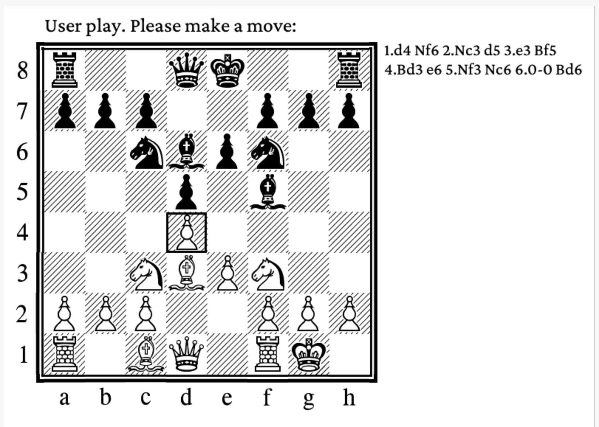
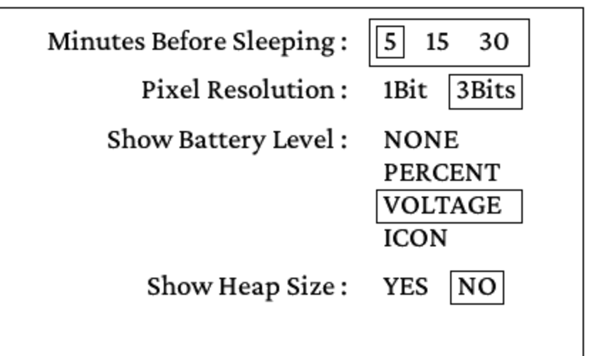
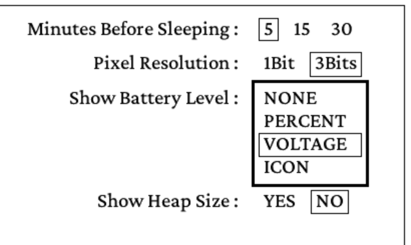
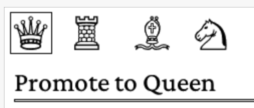

# Chess-InkPlate - User's Guide - Version 1.0.0

The Chess-InkPlate is a simple chess player application built specifically for the InkPlate ESP32 based devices.

For the installation process, please consult the `INSTALL.pdf` document.

Here are the main characteristics of the application:

- The chess engine was retrieved from the Arduino Chess application built by Sergey Urusov that you can find here: https://www.hackster.io/Sergey_Urusov/esp32-chess-engine-c29dd9.
- You can select the engine thinking duration to adapt to your level of play.
- Seven chess pieces fonts are supplied and selectable by the user.
- Display the chessboard and the list of moves played so far. 
- The moves are displayed using the PGN (Portable Game Notation) format.
- The user can choose to play white or black pieces. The chessboard will be flipped accordingly.
- Battery level can be selected to be displayed at the bottom of the screen
- Deep Sleep when a timeout duration is reached.
- Current game state is saved to be reloaded on startup after deep sleep recovery.
  
## 1. Application startup

When the device is turned ON, the application executes the following tasks:

- Load the fonts from the SDCard.
- Verify the presence of a saved game on the SD-Card and load it if present.
- Shows the chessboard. 
- The user is then ready to enter the first move.

## 2. Interacting with the application

InkPlate devices possess three tactical keys that are used to interact with the application. On the device, they are labeled 1, 2, and 3. The chess application requires that the device be used with the button located on the bottom side (landscape orientation):

  - Key 1 is the **SELECT** function
  - Key 2 is the **PREVIOUS** function
  - Key 3 is the **NEXT** function

All keys are associated with a second function when the user double-click on them. They are **DOUBLE-SELECT**, **DOUBLE-PREVIOUS**, and **DOUBLE-NEXT**.

In the sections below, the functions are called buttons.

### 2.1 The Chessboard

The Chessboard is the main display for the application. 

Piece and location selection are done using a cursor: a square box that shows the current location on the board. 

{ width=50% }

The user can change the location of the cursor using the following buttons:

- **PREVIOUS** - To displace the cursor to the left
- **NEXT** - To displace the cursor to the right
- **DOUBLE-PREVIOUS** - To displace the cursor down
- **DOUBLE-NEXT** - To displace the cursor up

Once the cursor is at the appropriate location, the user can use the **SELECT** button to indicate its choice to the system.

The interaction with the board is done through a two-step process:

1. The user selects the piece to be moved.
2. The user selects the location to move the piece to.

Once the target location has been selected, the application verifies that the move is a valid one, refresh the board, and launch the chess engine to compute the next move.

2.2 The Options menu

The **DOUBLE-SELECT** will open a list of options. These options are presented at the top of the screen with an icon and label shown below the icons. The list is as follow:

{ width=50% }

- **Return to the chessboard** - This will simply get out of the options list, back to the chessboard.
- **New game, play white** - This will initialize the chessboard for a new game, the user will play the white pieces. 
- **New game, play black** - This will initialize the chessboard for a new game, the user will play the black pieces. The chess engine will start the first piece movement.
- **Main parameters** - This will present a parameters form, allowing the user to modify some elements related to the application. Its content is described below.
- **Chess parameters** - This will present a parameters form, allowing the user to modify some elements related to the chess display and engine behavior. Its content is described below.
- **About the Chess-InkPlate application** - This will show a simple box showing the application version number and the Chess-InkPlate developer name (me!).
- **Power OFF (Deep Sleep)** - This option will put the device in DeepSleep. The current game is saved on the SD-Card and will be reloaded at boot time. The device will be restarted by pressing any button.

The **NEXT** and **PREVIOUS** buttons can be used to move the cursor from one option to the other. The **SELECT** button can then be used to select the option and execute its function. The **DOUBLE-SELECT** button will simply get out of the options list, back to the chessboard (The same behavior as if the first entry of the options list is selected).

### 2.3 The Main Parameters Form

As indicated in the previous section, the Main Parameters form allows for the modification of some items available to the user that will change some application behavior. Each item is presented with a list of options selectable through the use of the keys.

{ width=50% }

The following items are displayed:

- **Minutes Before Sleeping** - Options: 5, 15 or 30 minutes. This is the timeout period for which the application will wait before entering a Deep Sleep state. Deep Sleep is a means by which battery power usage is minimal. Once sleeping, the device will be rebooted at the press of a key.
- **Pixel Resolution** - Select how many bits are used for each pixel on the screen. 3 bits per pixel allow for the use of antialiasing for fonts but will require a complete screen update on every page change. 1 bit per pixel allows for the use of partial screen update, much faster refresh, but no antialiasing possible: the glyphs are displayed with irregularities.
- **Show Battery Level** - Options: NONE, PERCENT, VOLTAGE, ICON. This item is showing the battery level at the bottom left of the screen and is updated every time the screen is refreshed on the chessboard screen (It is *not* refreshed when the chess engine is in charge, the options menus, or the parameters forms are displayed). PERCENT will show the power percentage (2.5 volts and below is 0%, 3.7 volts and higher is 100%). VOLTAGE will show the battery voltage. The ICON is shown for all options, but NONE.
- **Show Heap Size** - When selected, the current heap size will be displayed at the bottom of pages. Two numbers are shown: the size of the largest memory chunk available and the total size of the available memory for the heap. This is mainly used to debug potential issues with memory allocation.
   
When the form is presented on the screen, the currently selected option of each item is surrounded by a small rectangle. A bigger rectangle appears around all options of the first item in the form (see Figure 3). It is a thin line rectangle, called the selecting box, that can be moved from an item to the other.

To be able to modify an item, you must first move the selecting box from one item to the other using the **NEXT** and **PREVIOUS** buttons. Then, you press the **SELECT** button. The selection box will change as a **bold** rectangle around the options (see Figure 4). You can change the current option with the **NEXT** and **PREVIOUS** button. Pressing the **SELECT** button again will then *freeze* the selection. The selection box will change to thin lines and will go to the next item.

{ width=50% }

To quit the form, use the **DOUBLE-SELECT** button. The new selected options will then be saved and applied by the application.

### 2.4 The Chess Parameters Form

As indicated in section 2.2, the Chess Parameters form allows for the modification of values related to chess display and engine usage. Each item is presented with a list of options selectable through the use of the keys.

{ width=50% }

The following items are displayed:

- **Engine Work Duration** - Options: 8, 10, 12, 15 points. This item will select the size of the characters to be presented on the screen, in points (1 point = ~1/72 of an inch). 
- **Chess font** - Seven fonts are supplied with the application for the chess pieces and board. This item permits the selection of the font to be used. 
   
### 2.5 The Pawn Promotion

When a pawn is moved on the eighth row, it will be promoted to become another chess piece. The user will be presented with a menu allowing him to choose what will be the new piece to promote the pawn to. Once chosen by the user, the move will be completed.

{ width=30% }
